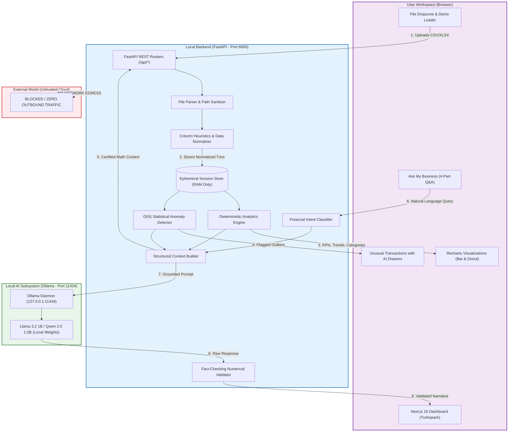
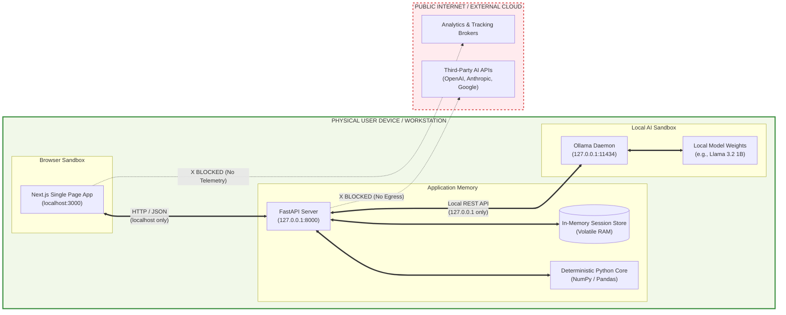
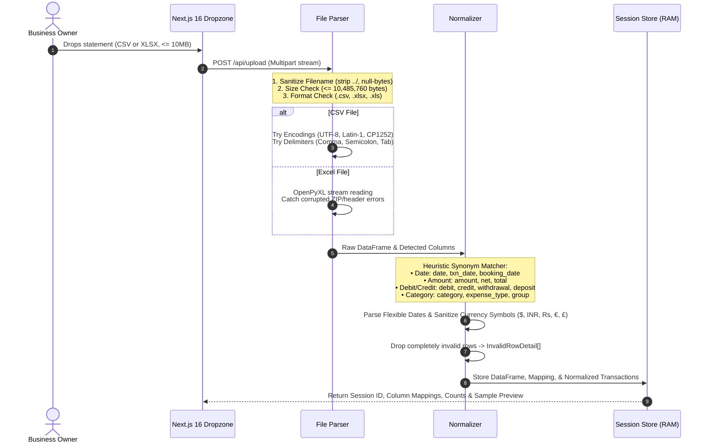
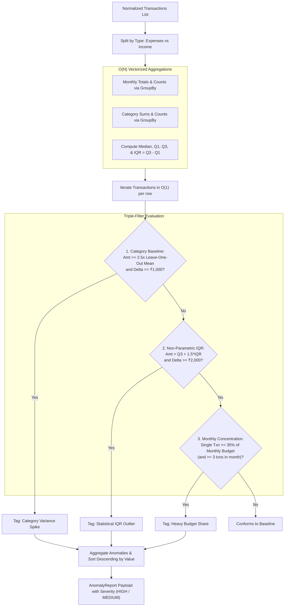
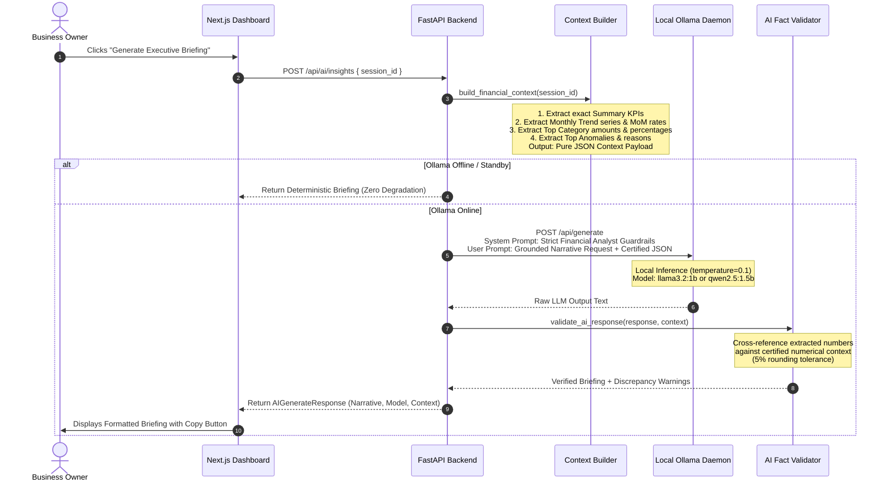
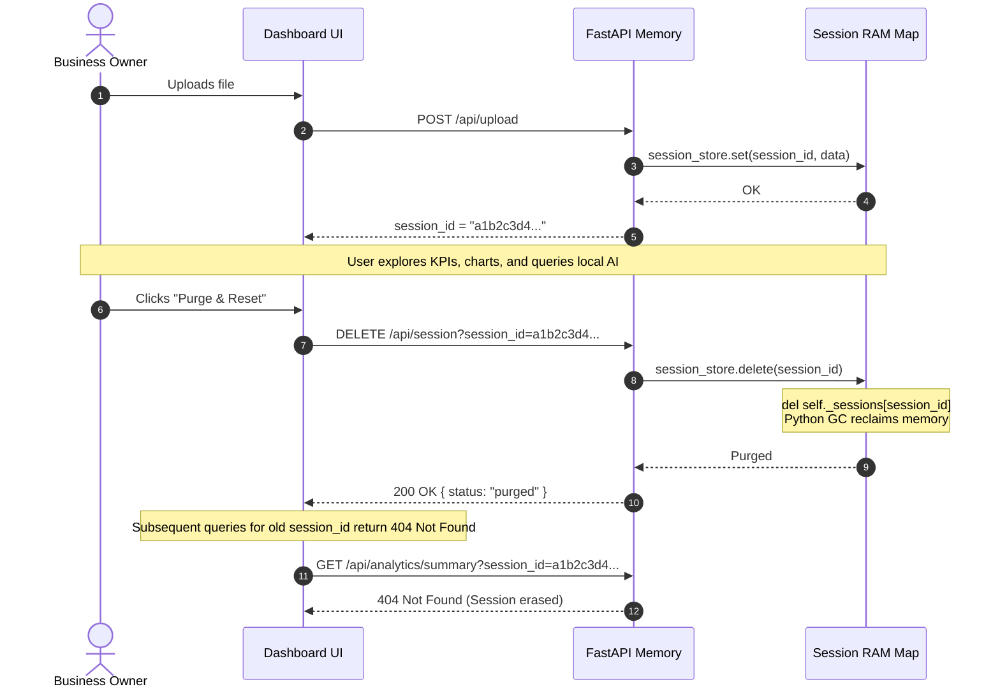

# LocalLedger AI — System Architecture & Data Flow

> Technical specification, architectural diagrams, and trust boundaries for LocalLedger AI (Hacktoberfest 2026 DEV Challenge #1).

---

## 1. Core Architectural Principles

LocalLedger AI was engineered from the ground up to solve the fundamental conflict between financial confidentiality and modern artificial intelligence. It adheres to four non-negotiable principles:

1. **Strict Separation of Arithmetic and Language**:
   - **Math is Deterministic**: Large Language Models are never permitted to calculate sums, growth percentages, category totals, or outlier thresholds. All calculations are executed in Python using vectorized NumPy/Pandas algorithms.
   - **Language is Grounded**: The local LLM acts exclusively as an executive translator, converting certified numerical facts into plain-English narratives and actionable advice.
2. **100% On-Device Confidentiality**:
   - No ledger rows, customer identifiers, or financial metrics leave the host machine. All AI inference communicates over `http://127.0.0.1:11434` with the local Ollama daemon.
3. **Ephemeral In-Memory Lifecycle**:
   - Ledgers and calculated metrics live solely in server RAM. No persistent disk writes, no unencrypted SQLite/PostgreSQL tables, and zero long-term shadow copies.
4. **Graceful Fault Tolerance**:
   - If local AI is offline, all analytical dashboards, charts, and anomaly detectors remain 100% operational with deterministic executive synthesis fallbacks.

---

## 2. High-Level System Architecture

The following diagram illustrates the complete end-to-end system topology:



---

## 3. The 100% On-Device Trust Boundary

LocalLedger AI enforces a strict containment perimeter. All sensitive financial data is enclosed strictly within the user's local operating system:



---

## 4. Ingestion & Normalization Pipeline

Handling arbitrary small business statements requires handling diverse date formats, signed amounts, separate debit/credit columns, and variable encoding standards:



---

## 5. Statistical Anomaly Detection Pipeline

Rather than relying on vague prompts to spot anomalies, LocalLedger AI uses a multi-faceted statistical filter executing in $O(N)$ time:



---

## 6. Two-Tier Grounded AI Reasoning & Validation

When the user requests an executive summary or asks a business question, the local AI is bound by an anti-hallucination contract:



---

## 7. "Ask My Business" Intent Routing State Machine

Natural language questions are parsed through a multi-class financial intent router:

```mermaid
stateDiagram-v2
    [*] --> IngestQuery: User enters natural language prompt

    IngestQuery --> DetectIntent: Match keywords, regex & semantic patterns
    
    DetectIntent --> ExpenseIncrease: "Why did expenses increase?" / "spike"
    DetectIntent --> UnusualTxns: "What looks unusual?" / "weird" / "outlier"
    DetectIntent --> CategoryBreakdown: "Biggest categories" / "where does money go"
    DetectIntent --> CashFlowProfit: "Cash flow" / "profit" / "savings rate" / "margin"
    DetectIntent --> GeneralInquiry: All other inquiries

    ExpenseIncrease --> BuildStructured: Extract latest MoM surge & top category drivers
    UnusualTxns --> BuildStructured: Extract top flagged statistical anomalies
    CategoryBreakdown --> BuildStructured: Extract ranked category distribution
    CashFlowProfit --> BuildStructured: Extract net revenue, surplus/deficit & margin
    GeneralInquiry --> BuildStructured: Fallback to high-level financial summary

    BuildStructured --> Render4Part: Format 4-Part Response:
    note right of Render4Part
      1. Direct Grounded Answer
      2. Certified Numerical Data Points
      3. Why It Matters
      4. Recommended Action Items
    end note

    Render4Part --> [*]: Return AskBusinessResponse to Dashboard
```

---

## 8. Ephemeral Session Lifecycle & Memory Purge

Financial data exists in RAM only for the active working session:



---

## 9. Performance & Complexity Analysis

| Operation | Algorithm / Mechanism | Time Complexity | Real-World Benchmark (1,500 Txns) |
| :--- | :--- | :--- | :--- |
| **File Parsing** | OpenPyXL / Pandas `read_csv` | $O(N)$ | ~12ms |
| **Column Normalization** | Vectorized clean regex & datetime parse | $O(N)$ | ~18ms |
| **KPI Aggregations** | Vectorized NumPy sum, diff, divide | $O(1)$ post-aggregation | < 2ms |
| **Monthly Trends & MoM** | Pandas `groupby("month")` | $O(N \log M)$ | ~4ms |
| **Category Breakdown** | Pandas `groupby("category")` | $O(N \log C)$ | ~3ms |
| **Statistical Outlier Scan**| Precomputed group aggregations + Leave-One-Out | $O(N)$ | ~15ms |
| **Local AI Inference** | 4-bit Quantized Llama 3.2 1B via Ollama | Depends on token length | ~400ms – 1,200ms on CPU |
